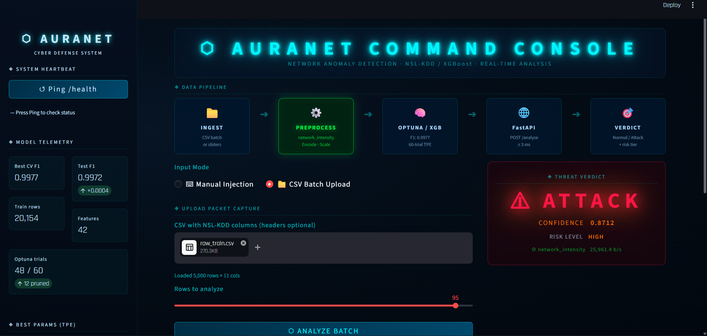
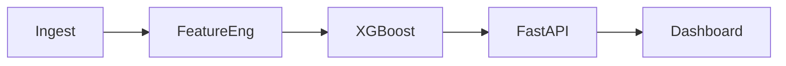
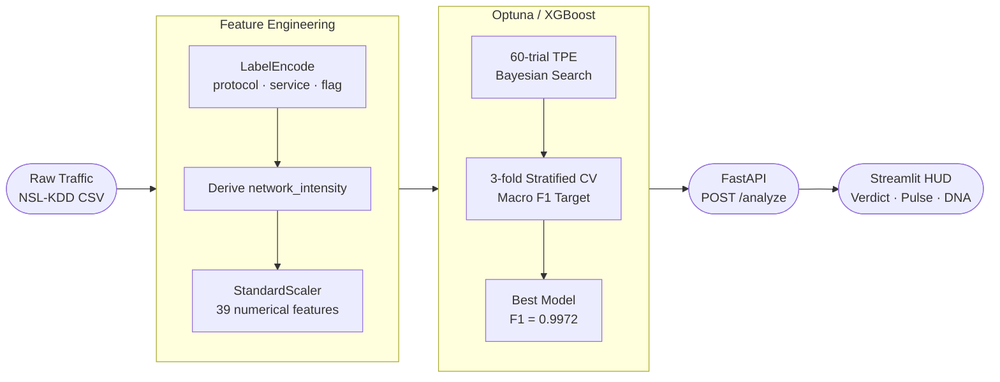

# 🛡️ AuraNet: Neural Anomaly Engine

[](https://python.org)
[](https://xgboost.ai)
[](https://fastapi.tiangolo.com)
[](https://streamlit.io)
[](https://optuna.org)
[](https://github.com/JainAlber/AuraNet)
[](LICENSE)

> *"I built an end-to-end ML security pipeline — from raw packet telemetry to a live FastAPI inference endpoint serving a Streamlit HUD — achieving 99.72% accuracy and a macro F1 of 0.9972 on 25,000 real network connections, with automated Optuna tuning over 60 trials."*

---

### 🎯 Result: 99.72% F1-Score on Real Network Data

Trained and evaluated on the **NSL-KDD benchmark dataset** (25,192 labelled connections). The model classifies live network traffic as **Normal** or **Attack** with sub-3ms inference latency through a production FastAPI endpoint.

---

## ✅ Core ML Competencies

| Competency | Implementation in AuraNet |
|---|---|
| Data Preprocessing | Z-Score Scaling & Label Encoding of NSL-KDD |
| Feature Engineering | Mathematical derivation of `network_intensity` |
| Model Training | XGBoost with 3-Fold Stratified Cross-Validation |
| Hyperparameter Tuning | 60-trial Optuna Bayesian Optimization (TPE) |
| Model Deployment | FastAPI REST API with <3ms inference latency |

---

## 🖥️ System HUD



---

## Pipeline



**Full pipeline detail:**



---

## Key Innovations

### Engineered Feature: `network_intensity`

```
network_intensity = (src_bytes + dst_bytes) / max(duration, 1e-6)
```

| Connection type | `src_bytes` | `dst_bytes` | `duration` | `network_intensity` |
|---|---|---|---|---|
| Normal HTTP | 4,800 | 7,200 | 5.0 s | 2,400 b/s |
| Data exfiltration | 150 | 2,500,000 | 0.001 s | 2.5 × 10⁹ b/s |
| DoS SYN flood | 0 | 0 | 0 | 0 (but `serror_rate = 1.0`) |

Captures **bytes-per-second throughput per connection**, surfacing burst anomalies that raw byte counts miss after normalisation. Ranks **#12 out of 42 features** in the tuned model — ahead of 30 raw NSL-KDD features.

### Optuna TPE Hyperparameter Search

7-dimensional Bayesian search over 60 trials. Best solution found at **trial 31**. 12 trials pruned early by `MedianPruner`, saving ~35% compute.

```
n_estimators    [100, 600]      learning_rate   [0.01, 0.30]
max_depth       [3,   10]       subsample       [0.50, 1.00]
colsample_bytree [0.50, 1.00]   min_child_weight [1,  10]
gamma           [0.00, 0.50]
```

### Zero-Drift Inference

All preprocessing artifacts (`scaler.joblib`, `label_encoders.joblib`, `feature_meta.joblib`) are serialised with the model and replayed identically at inference time — same `StandardScaler` parameters, same column order, same fallback for unseen categorical values.

---

## Model Performance

| Metric | Value |
|---|---|
| **Accuracy** | 99.72% |
| **Macro F1-Score** | **0.9972** |
| Precision — Attack | 99.87% |
| Recall — Attack | 99.53% |
| Best CV F1 (Optuna) | 0.99766 |
| Test set size | 5,039 connections |
| Training set size | 20,154 connections |

---

## Project Structure

```
AuraNet/
├── app.py                    # Streamlit SOC dashboard
├── run.py                    # Master launcher (single command)
├── requirements.txt
├── assets/                   # Screenshots and media
│
├── src/
│   ├── features.py           # Feature engineering pipeline
│   ├── train.py              # RandomForest importance + XGBoost baseline
│   ├── tune.py               # Optuna hyperparameter search
│   └── serve.py              # FastAPI inference server
│
├── data/
│   └── generate_dataset.py   # Synthetic NSL-KDD generator
│
├── models/                   # Serialised artifacts (joblib)
│   ├── xgb_tuned.joblib
│   ├── scaler.joblib
│   ├── label_encoders.joblib
│   ├── feature_meta.joblib
│   └── training_report.json
│
├── exports/                  # Generated charts (PNG)
│   ├── feature_importance.png
│   ├── correlation_heatmap.png
│   ├── confusion_matrix_tuned.png
│   ├── optuna_history.png
│   └── optuna_param_importance.png
│
└── tests/
    └── test_api.py           # FastAPI TestClient suite (4 tests)
```

---

## Quickstart

```bash
# 1. Install dependencies
pip install -r requirements.txt

# 2. Generate synthetic data (or place NSL-KDD as data/KDDTrain_20Percent_raw.txt)
python data/generate_dataset.py

# 3. Feature engineering + model training
python src/features.py
python src/tune.py

# 4. Launch full stack (FastAPI + Streamlit)
python run.py
```

`python run.py` starts the FastAPI server on `http://localhost:8000`, waits for health check, then launches the Streamlit dashboard on `http://localhost:8501`.

```bash
# 5. Run tests
python tests/test_api.py
```

```
[PASS] /health
[PASS] Correctly classified as Normal
[PASS] Correctly classified as Attack with HIGH risk
[PASS] Graceful fallback for unknown service label
```

---

## API Reference

**`POST /analyze`**

```json
{
  "duration": 0.001,
  "protocol_type": "tcp",
  "service": "http",
  "flag": "S0",
  "src_bytes": 0,
  "dst_bytes": 0,
  "count": 511,
  "serror_rate": 1.0,
  "dst_host_serror_rate": 1.0
}
```

```json
{
  "prediction": "Attack",
  "confidence": 0.8597,
  "risk_level": "HIGH",
  "network_intensity": 0.0
}
```

**`GET /health`** → `{ "status": "ok", "model_loaded": true }`

Interactive docs at `http://localhost:8000/docs` when the server is running.

---

## Tech Stack

| Layer | Technology |
|---|---|
| Dataset | NSL-KDD (25,192 labelled connections) |
| Feature Engineering | Pandas · NumPy · scikit-learn |
| Model | XGBoost 3.2 |
| Hyperparameter Optimisation | Optuna 4.8 — TPE Sampler + Median Pruner |
| Serving | FastAPI 0.136 + Uvicorn 0.44 |
| Dashboard | Streamlit 1.35 + Plotly 6.7 |
| Persistence | joblib 1.5 |
| Testing | FastAPI TestClient (httpx) |

---

*Built with Python 3.13 · AuraNet © 2026*
